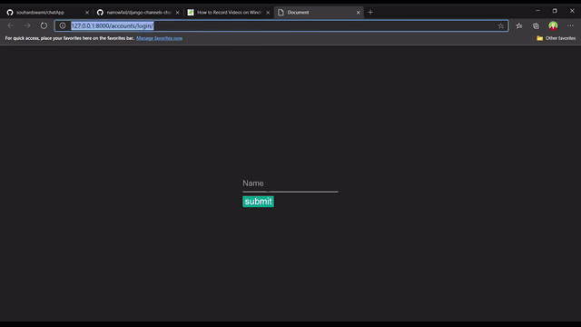

# chatApp
This is chat based a project built in django channel and javascript websocket.

Token based comminication between two peer.

At a time only one person can talk to other user.




## OverView ##

When a user(A) is login then any other login user(B-C-D-E) can use his(A) token(32 digit) to proceed comminication between User(A).

When Any other user will be connected with user(A) then user(A) will notify that User (X) is connected and User (X) also get informed that he is connected with User(A).

In any type of failure User will  notified.

now Both user are connected so other third user cann't join them and cann't track their chatting.if he will try he will get a massage 'Room is Full'.

IN both of them if any leave the room then other user will notify so now third user can join either First or Second user.


## Architecture ##
**socket** 

Socket programming is a way of connecting two nodes on a network to communicate with each other. One socket(node) listens on a particular port at an IP, while other socket reaches out to the other to form a connection. Server forms the listener socket while client reaches out to the server.
They are the real backbones behind web browsing. In simpler terms there is a server and a client.

**async io**

An async  is a function declared with the async keyword. Async functions are instances of the AsyncFunction constructor, and the await keyword is permitted within them. The async and await keywords enable asynchronous, promise-based behavior to be written in a cleaner style, avoiding the need to explicitly configure promise chains.


## Installation

Please refer to Django [documentation](https://docs.djangoproject.com/en/1.9/intro/overview/#install-it) for more details.

for this project refer this Django-channel [documentation](https://channels.readthedocs.io/en/latest/introduction.html) to get more info.

* clone this project 

```
git clone git@github.com:souhardswami/chatApp.git
```

* move to  root directory
```
cd chatApp
```

* create a virtual environment

```
python3 -m venv myenv
cd myenv/Scripts
source activate
cd ../..
```

* install requirements
```
pip install -r requirements.txt
```

# Run
```
python manage.py makemigrations
python manage.py migrate
python manage.py runserver

```

[open](127.0.0.8000) 127.0.0.8000


## todo

- database access in async mode
- user authentication

## extra source


More about redis server [documentation](https://pypi.org/project/channels-redis/)


